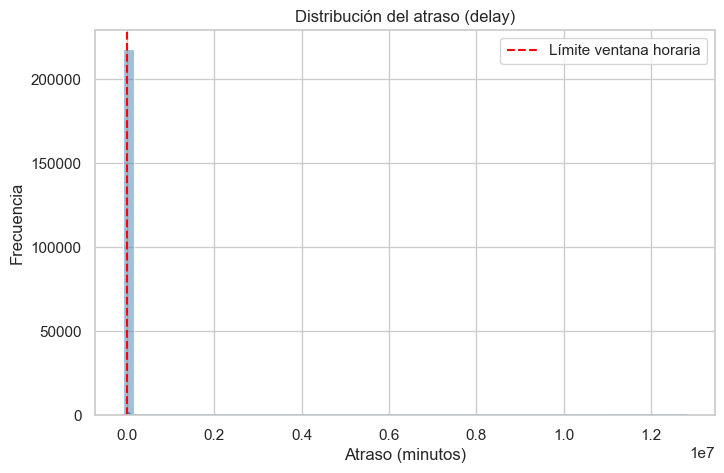
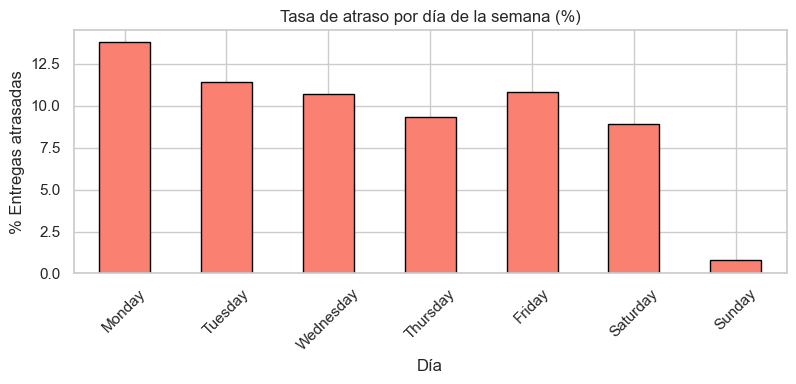
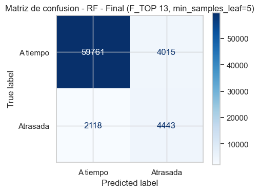
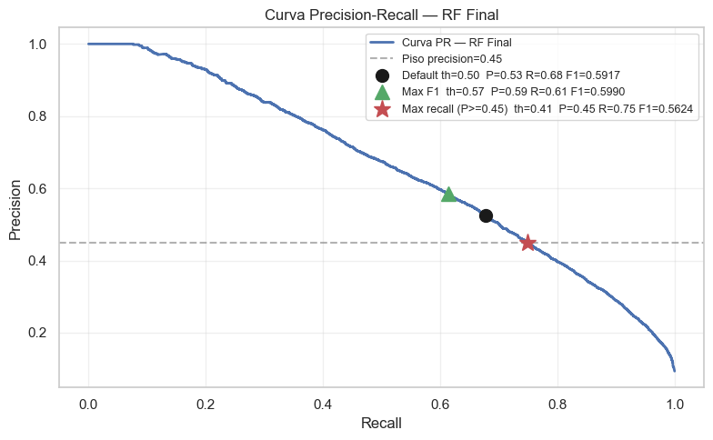
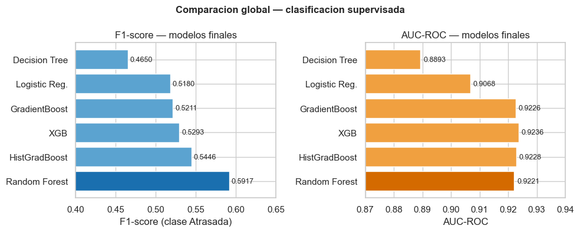
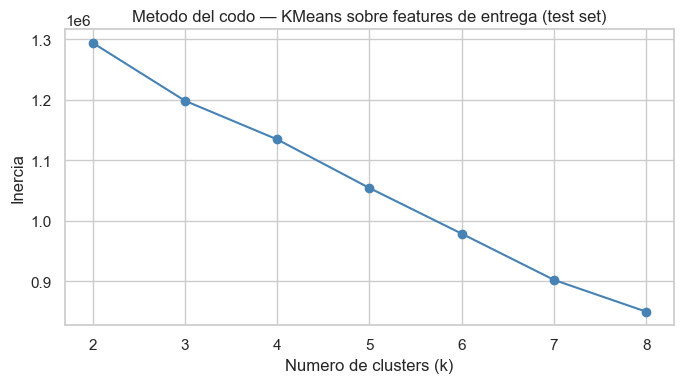
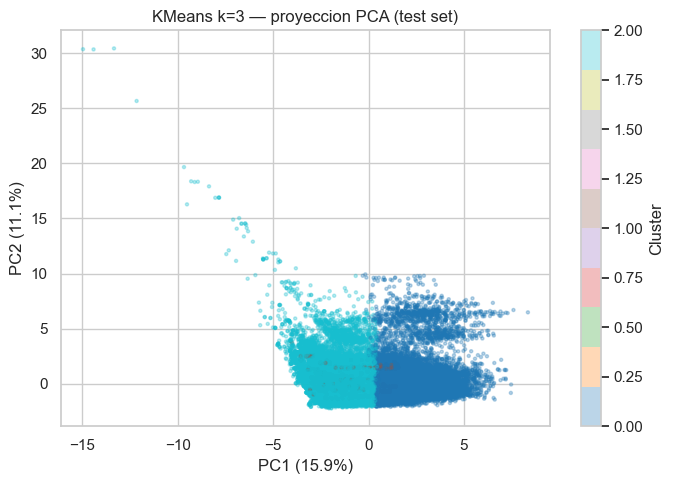
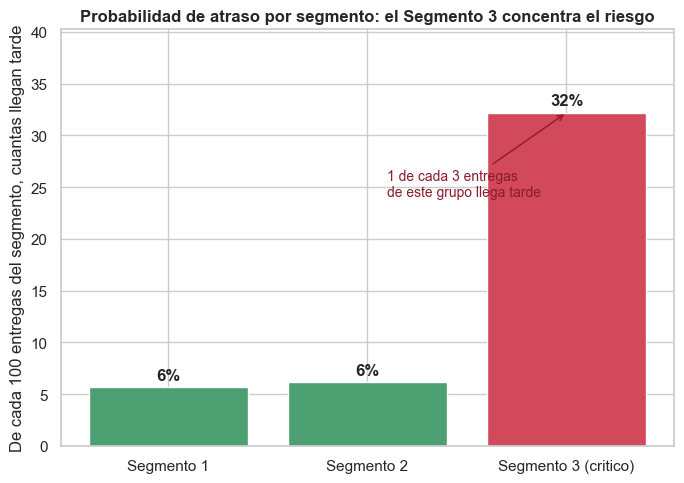
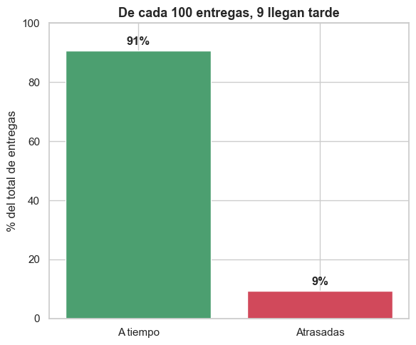

# Informe Final de Minería de Datos: Predicción de Atrasos en Rutas de Última Milla

---

### 1\. Comprensión del Negocio (Business Understanding)

#### 1.1 Contexto del Negocio y Problema Operativo

La logística de última milla concentra cerca del 53% del costo de envío y opera bajo una presión estructural: cada parada tiene una ventana comprometida con el cliente que no admite margen de error sin consecuencias comerciales. En la operación analizada, el 11.1% de las entregas en datos crudos experimentaron retrasos. Ese volumen genera costos directos por reintentos de distribución y deteriora la confianza del cliente cuando el incumplimiento del horario se vuelve recurrente.

El modelo operativo actual reacciona al atraso cuando ya ocurrió. Este proyecto construye un sistema de predicción que evalúa el riesgo de cada parada activa mientras el transportista está en ruta, usando las señales que el propio sistema de escaneo genera en tiempo real, y produce dos salidas accionables: una alerta binaria de riesgo y una estimación de la magnitud del retraso en minutos.

#### 1.2 Formulación del Problema Analítico y Objetivos

El problema operativo se aborda mediante dos aproximaciones complementarias:

1. **Clasificación Binaria:** Predecir si una parada específica en una ruta activa llegará tarde respecto al límite acordado (`delayed = 1` o `delayed = 0`). Esta alerta temprana sirve para identificar desvíos en tiempo real.  
2. **Regresión Numérica:** Estimar la cantidad exacta de minutos de desviación en la llegada (`delay` en minutos). Esta estimación sirve para calibrar la severidad del incidente.

El objetivo consiste en identificar qué variables del plan de ruta, del trayecto real y del historial del conductor permiten predecir el atraso de una entrega, operando como un motor de decisión en tiempo real durante la ruta.

#### 1.3 KPIs del Negocio y Métricas Analíticas

Establecimos tres indicadores de rendimiento sobre el dataset inicial para alinear la evaluación analítica con el impacto operativo de la organización:

| KPI de Negocio | Descripción Operativa | Línea Base (Datos Crudos) |
| :---- | :---- | :---: |
| **Tasa de entregas a tiempo** | Porcentaje de paradas donde el tiempo real de arribo no supera el límite programado. | **88.9%** |
| **Atraso promedio** | Media de minutos de retraso registrada exclusivamente en las entregas que incumplieron la ventana. | **1,478.4 min** |
| **Desviación de ruta promedio** | Diferencia promedio en posiciones de secuencia entre el orden planificado y el real. | **1.64 posiciones** |


El retraso promedio de 1,478.4 minutos observado en los datos iniciales indica errores de registro en el sistema logístico. Es físicamente imposible que un reparto urbano diario acumule más de 24 horas de retraso promedio, lo que justifica la aplicación de filtros de limpieza en etapas posteriores.

---

### 2\. Comprensión y Exploración de Datos (Data Understanding)

#### 2.1 Estructura del Dataset y Filtrado de Depósitos

El análisis utiliza el dataset de desviaciones en rutas de última milla ("Last-mile delivery route deviations dataset: planned vs. actual routes"), el cual registra 249,231 filas distribuidas en 16 columnas.

**Estructura del dataset (`df.info()`):**

```text
<class 'pandas.DataFrame'>
Index: 218006 entries, 1 to 249230
Data columns (total 16 columns):
 #   Column         Non-Null Count   Dtype
 0   Route ID       218006 non-null  int64
 1   Driver ID      218006 non-null  int64
 2   Stop ID        218006 non-null  int64
 3   Address ID     218006 non-null  int64
 4   Week ID        218006 non-null  int64
 5   Country        218006 non-null  int64
 6   Day of Week    218006 non-null  str
 7   IndexP         218006 non-null  int64
 8   IndexA         218006 non-null  int64
 9   Arrived Time   218006 non-null  float64
 10  Earliest Time  218006 non-null  float64
 11  Latest Time    218006 non-null  float64
 12  DistanceP      218006 non-null  float64
 13  DistanceA      218006 non-null  float64
 14  Depot          218006 non-null  int64
 15  Delivery       218006 non-null  int64
dtypes: float64(5), int64(10), str(1)
```
Las filas correspondientes a los depósitos de inicio y fin de ruta (`Depot == 1`, `Delivery == 0`) se excluyeron del análisis. Estos registros representan la base de carga y retorno de los vehículos, por lo que reportan de manera sistemática distancias nulas y tiempos de retraso negativos muy altos. Incluirlos en el modelado causaría un sesgo que inflaría artificialmente la tasa de entregas a tiempo. Tras remover estas 31,225 filas, el dataset de entregas reales a clientes quedó en 218,006 registros.

**Filtrado de depósitos (`Delivery == 1`):**

```text
Filas totales originales:        249,231
Filas de entrega (Delivery=1):   218,006
Filas excluidas (depósito):       31,225
```

#### 2.2 Creación de Variables Derivadas Iniciales

Calculamos tres variables fundamentales a partir de los datos base:

1. **`delay` (minutos):** La diferencia entre `Arrived Time` y `Latest Time`. Los valores positivos representan el retraso neto, mientras que los negativos expresan la holgura en minutos con la que se completó el servicio.  
2. **`delayed` (binaria):** Toma el valor 1 si el arribo superó el límite programado (`delay > 0`) y 0 en caso contrario.  
3. **`route_deviation` (secuencia):** La desviación absoluta entre la secuencia planificada y la real, calculada como `abs(IndexP - IndexA)`.

**Estadísticos de las variables derivadas:**

| Estadístico | delay | delayed | route_deviation |
| :--- | ---: | ---: | ---: |
| count | 218,006 | 218,006 | 218,006 |
| mean | −18.46 | 0.11 | 1.64 |
| std | 35,538.91 | 0.31 | 2.57 |
| min | −90,879.37 | 0.00 | 0.00 |
| 50% | −125.64 | 0.00 | 1.00 |
| max | 12,814,081.85 | 1.00 | 27.00 |

La variable binaria de retraso confirmó que el 11.1% de las paradas sufrieron demoras, lo que define un problema de clasificación con desbalance moderado. Por su parte, la mediana de `delay` se ubicó en \-125.6 minutos. Esto muestra que la mayoría de los repartos a tiempo se realizan con más de dos horas de holgura. Sin embargo, el valor máximo de `delay` alcanzó los 12.8 millones de minutos, lo que ratificó la necesidad de una limpieza profunda.

#### 2.3 Hallazgos del Análisis Exploratorio (EDA)

El comportamiento por día de la semana reflejó que los lunes registran la tasa de retraso más alta con un 13.8%, la cual desciende gradualmente hasta el jueves al ubicarse en 9.3%. Las rutas del domingo presentan un comportamiento atípico con solo 0.8% de atraso, comportamiento asociado a un volumen bajo de actividad (1,697 paradas frente a las más de 40,000 de los días laborables).



El análisis por país reveló dos dinámicas operativas distintas. El País 0 cuenta con 73,575 entregas, registrando un 13.8% de retraso y una desviación de ruta promedio de 1.07 posiciones. El País 1 reporta 144,431 entregas, con una tasa de retraso menor del 9.7% pero con una desviación de ruta promedio mayor de 1.94 posiciones. Esto indica que alterar el orden de las paradas no es la causa directa del atraso, sino que puede ser una estrategia del conductor para evitar zonas congestionadas y optimizar sus tiempos en ese mercado.

Detectamos errores de captura representados por ventanas de entrega con límite en el minuto cero (`Latest Time == 0`), retrasos extremos superiores a 8 horas (`delay > 480 min`) y registros de ventanas horarias que superan las 24 horas del día (`Latest Time > 1440 min`).

---

### 3\. Preparación de Datos y Ciclo de Iteraciones (Data Preparation)

La preparación de datos se organizó en dos iteraciones sucesivas. La primera eliminó registros con inconsistencias físicas no recuperables. La segunda auditó los extremos plausibles para no destruir variabilidad real que los modelos necesitan capturar. El resultado fue un dataset limpio con criterio operacional, no estadístico.

#### 3.1 Iteración 1: Limpieza de Inconsistencias Duras

La primera iteración aplicó reglas operacionales estrictas sobre el dataset de 218,006 registros:

* Se eliminaron 22 registros con ventana horaria inválida (`Latest Time == 0`).  
* Se descartaron 1,219 registros con retrasos superiores a 8 horas (`delay > 480 min`), bajo el supuesto de que corresponden a fallas de escaneo al cierre de la ruta.  
* Se excluyeron 1,126 registros cuyas ventanas horarias superaban las 24 horas del día (`Latest Time > 1440 min`).

Este primer filtro depuró 2,367 registros inconsistentes, lo que representa el 1.09% del dataset, conservando 215,639 filas.

#### 3.2 Iteración 2: Auditoría y Tratamiento de Outliers Plausibles

A partir del grupo depurado en la primera iteración, evaluamos los valores extremos restantes sin recurrir al descarte estadístico ciego por IQR. Esta auditoría manual diferenció entre errores de registro y conductas operativas extremas pero válidas:

* **Registros eliminados:** Se removieron 50 filas con tiempos de llegada fuera del límite diario (`Arrived Time > 1440 min`) y 5 registros cuyas ventanas no tenían duración positiva (`Latest Time - Earliest Time <= 0`).  
* **Registros conservados:** Se mantuvieron los tramos de larga distancia (hasta 551 km de distancia planificada y real) al comprobar la correspondencia espacial entre ambas mediciones. Asimismo, conservamos las desviaciones de secuencia superiores a 10 posiciones y las rutas con más de 22 paradas para no eliminar la variabilidad real que los modelos predictivos deben capturar.

```text
=== Tratamiento adicional de outliers plausibles ===
  Registros antes del tratamiento adicional:    215,639
  Eliminados (Arrived Time > 1440):                  50
  Eliminados (ventana <= 0):                          5
  Registros finales post-limpieza:              215,584
  Datos conservados finales:                 98.89%
```

Esta segunda iteración generó el dataset principal de modelado (`df_clean`), consolidado con **215,584 registros (98.89% del volumen inicial)**. La tasa de entregas a tiempo se recalculó en 89.4%, el atraso promedio real bajó a 70.7 minutos (con una mediana de 44.7 minutos) y la desviación de ruta promedio se estableció en 1.65 posiciones.

```text
        KPIs post-limpieza de outliers
=============================================
  Tasa de entregas a tiempo:   89.4%
  Atraso promedio (atrasadas): 70.7 min
  Atraso mediana  (atrasadas): 44.7 min
  Desviación de ruta promedio: 1.65 posiciones
```

#### 3.3 Construcción de la Variante Sensible a Outliers

Para evitar que los modelos lineales y las redes neuronales sufrieran distorsiones en sus coeficientes debido a la escala de las variables continuas, creamos una partición alternativa denominada `df_clean_sensitive`. Esta variante excluye los extremos operacionales plausibles previamente conservados: distancias mayores a 100 km, desviaciones de ruta superiores a 10 posiciones e índices de secuencia mayores a 21.5 paradas. Esta depuración descartó 6,871 registros adicionales (3.19% de `df_clean`), dejando un total de **208,713 filas** para este pipeline específico.

#### 3.4 Ingeniería de Variables y Prevención de Data Leakage

El escenario de predicción es la ejecución activa de la ruta: el sistema dispone de la información hasta el momento del último escaneo del conductor, y debe emitir un juicio sobre la parada siguiente antes de que el vehículo arranque. Bajo esa restricción, se descartaron `Route ID`, `Driver ID`, `Stop ID` y `Address ID` por ser identificadores sin capacidad de generalización. `Arrived Time` y `delay` quedaron excluidos de la tarea de clasificación porque contienen la respuesta que se quiere predecir; incluirlos habría producido un modelo que aprende a mirar la solución en lugar de anticiparla.

Sobre esa base se construyeron siete variables de estado de la ruta. `ventana` captura la estrechez temporal de la parada (`Latest Time - Earliest Time`): una ventana de 30 minutos no tolera la misma demora acumulada que una de 180\. `index_diff` (`IndexA - IndexP`) registra si el conductor adelantó o postergó la parada respecto al plan; valores positivos indican que el conductor está ejecutando paradas fuera de orden. `distance_ratio` (`DistanceA / (DistanceP + 1)`) cuantifica cuánto se alejó el trayecto real del planificado. Las tres variables capturan el estado estático de la parada en el momento de la predicción.

Las cuatro variables restantes son señales de estado dinámico de la ruta. `delayed_prev_stop` es una bandera binaria que se activa cuando la parada anterior cerró tarde; su correlación de 0.378 con `delayed` revela que el atraso no es un evento aislado sino que se hereda. `delayed_cumrate_route` acumula la proporción de paradas tardías en la ruta hasta ese instante; con correlación de 0.389, es la señal más fuerte del dataset y es la que el pipeline de producción actualiza tras cada escaneo. `stops_so_far` cuenta las paradas completadas; a mayor avance en la ruta, mayor es el retraso acumulado que puede arrastrar el conductor. `driver_late_rate_hist` calcula la tasa histórica de retraso del conductor usando `.shift(1)` sobre una ventana de expansión temporal, de modo que el resultado de la entrega actual no contamina su propio historial; su correlación de 0.322 confirma que el comportamiento pasado del conductor tiene poder predictivo independiente de la ruta asignada. Ninguna variable original del dataset alcanzaba correlación superior a 0.05 con el target.

```python
# Derivadas operativas
df["ventana"]        = df["Latest Time"] - df["Earliest Time"]
df["index_diff"]     = df["IndexA"] - df["IndexP"]
df["distance_ratio"] = df["DistanceA"] / (df["DistanceP"] + 1)

# Señales secuenciales dentro de la ruta (solo paradas anteriores)
df = df.sort_values(["Route ID", "IndexP"])
df["delayed_prev_stop"]     = df.groupby("Route ID")["delayed"].shift(1).fillna(0)
df["delayed_cumrate_route"] = (df.groupby("Route ID")["delayed"]
                                 .apply(lambda x: x.shift(1).expanding().mean())
                                 .reset_index(level=0, drop=True).fillna(0))
df["stops_so_far"]          = df.groupby("Route ID").cumcount()

# Historial del conductor con .shift(1) para evitar leakage del registro actual
df = df.sort_values(["Driver ID", "Week ID", "IndexP"])
df["driver_late_rate_hist"] = (df.groupby("Driver ID")["delayed"]
                                 .apply(lambda x: x.shift(1).expanding().mean())
                                 .reset_index(level=0, drop=True)
                                 .fillna(df["delayed"].mean()))
```

```text
=== Dataset principal listo para modelado ===
  Shape de X:   (215584, 22)     Predictores: 22
  Atrasadas:    22,833 (10.6%)    Valores nulos en X: 0
```


#### 3.5 Estrategia de Partición Temporal y Escalado

Rechazamos el split aleatorio tradicional debido a la dependencia temporal implícita en las variables secuenciales de ruta y en el historial del conductor. Mezclar registros pasados y futuros en el entrenamiento habría provocado un sesgo de evaluación poco realista.

Establecimos una partición temporal estricta ordenando los datos por `Week ID`. Las semanas anteriores a la semana 22 se asignaron al conjunto de entrenamiento (**67.4% de las filas, 145,247 registros**), mientras que las semanas 22 a 31 conformaron el conjunto de evaluación (**32.6% de las filas, 70,337 registros**). La tasa de retraso se mantuvo balanceada con un 11.2% en el conjunto de entrenamiento y un 9.3% en el conjunto de prueba.

```text
=== Particion train/test temporal - dataset principal ===
  Corte: Week ID < 22  (rango: semana 0 a 31)
  Train:  145,247 filas  (67.4%)
  Test:    70,337 filas  (32.6%)
  Train atrasadas:  16,272 (11.2%)
  Test atrasadas:    6,561 (9.3%)
```

El escalado mediante `StandardScaler` se entrenó exclusivamente sobre el conjunto de entrenamiento y se aplicó por separado al conjunto de prueba. Conservamos una copia de las matrices sin escalar para entrenar los modelos basados en árboles de decisión.

---

### 4\. Evaluación de Modelos Supervisados

#### 4.0 Punto de Partida: Modelos de la Entrega 2

La Entrega 2 fijó dos modelos de referencia. En clasificación, una regresión logística sobre las 15 variables base alcanzó un **F1-Score de 0.3352 y un AUC de 0.7804**: detectaba apenas 1 de cada 3 atrasos reales con el umbral estándar, un rendimiento compatible con no tener modelo. En regresión, el OLS sobre el mismo conjunto de 15 variables base registró **R² de 0.605 y RMSE de 96.35 minutos**, y en las 6,561 entregas tardías del conjunto de prueba predijo un promedio de −90.26 minutos —signo invertido, sin valor para el negocio—. Ambos modelos operaban sobre variables estáticas del dataset sin las señales dinámicas de estado de ruta construidas en §3.4. Esa ausencia explica el techo de rendimiento: la información disponible en la Entrega 2 no contenía la señal necesaria.

```text
  Regresión Logística — Entrega 2 (LR P1, 15 features base)
  F1-score (clase Atrasada):  0.3352
  AUC-ROC:                    0.7804
```

```text
  OLS — Entrega 2 (OLS P1, 15 features base)
  RMSE test: 96.35 min   |   MAE test: 68.49 min   |   R2 test: 0.6051
  Predicción media en atrasadas (n=6,561): -90.26 min   (signo invertido)
```

#### 4.1 Elección de Métricas de Rendimiento

Con un 10.6% de retrasos en el conjunto de datos limpio, la accuracy como métrica principal es una trampa: un predictor que etiquete siempre como "a tiempo" obtendría 89.4% de exactitud sin detectar un solo atraso. La métrica central de clasificación es el **F1-Score sobre la clase positiva** (`delayed = 1`), que penaliza tanto los atrasos no detectados (falsos negativos) como las falsas alarmas (falsos positivos) de forma equilibrada. Para la tarea de regresión se usaron $R^2$, RMSE y MAE en minutos. Pero la métrica más reveladora es el `MAE_late` y, sobre todo, la dirección de la predicción promedio en el subgrupo de entregas tardías: un modelo que predice valores negativos en ese subgrupo lo malinterpreta por completo, aunque su $R^2$ global sea alto. Esa señal de sesgo guió la selección de modelo de regresión tanto como el error cuadrático.

| Modelo | F1 | AUC | Accuracy |
| :--- | :---: | :---: | :---: |
| **Random Forest** | **0.5917** | 0.9221 | 0.9128 |
| HistGradientBoosting | 0.5446 | 0.9228 | 0.8771 |
| XGBoost | 0.5293 | **0.9236** | 0.8664 |
| Gradient Boosting | 0.5211 | 0.9226 | 0.8602 |
| Regresión Logística | 0.5180 | 0.9068 | 0.8722 |
| Decision Tree | 0.4650 | 0.8893 | 0.8285 |

#### 4.2 Proceso Evolutivo y Modelos de Clasificación

Partiendo del F1 de 0.3352 de la Entrega 2, el primer cambio fue incorporar las señales secuenciales e históricas construidas en la fase de preparación. Con el conjunto completo de 22 variables, la regresión logística (P8) subió a un **F1 de 0.5180 y un AUC de 0.9068**, un salto de casi 18 puntos de F1 sin cambiar el algoritmo. Eso confirmó que el cuello de botella no era el modelo sino los datos de entrada: las variables originales del dataset no contenían señal suficiente para el problema de clasificación.

```text
  LR - P8 (F_FULL, 22 features)
  F1-score (clase Atrasada):  0.5180   (vs 0.3352 en LR P1)
  AUC-ROC:                    0.9068   (vs 0.7804 en LR P1)
```

El árbol de decisión sin restricciones (P1) sufrió un sobreajuste severo con una profundidad de 40 niveles: F1 de 1.0 en entrenamiento pero 0.2409 en el conjunto de prueba (AUC de 0.5806). Al regularizar la estructura limitando la profundidad a 10 niveles y exigiendo un mínimo de 50 muestras por hoja, se controló el sobreajuste y el F1 subió a 0.4650 con un AUC de 0.8893 en prueba, ya por encima del modelo de la Entrega 2\.

```text
  DT - P1 (sin max_depth)         profundidad=40   F1 train=1.0000   F1 test=0.2409   AUC=0.5806
  DT - Final (depth=10, leaf=50)                   F1 test=0.4650    AUC=0.8893
```

Los ensambles de árboles superaron de forma consistente a los modelos anteriores. El bosque aleatorio final, entrenado con las 13 variables del conjunto reducido `F_TOP` y regularizado con un mínimo de 5 muestras por hoja, logró el rendimiento más alto del proyecto: **F1-Score de 0.5917 y AUC de 0.9221** con el umbral estándar de 0.50, frente al F1 de 0.3352 del modelo de referencia de la Entrega 2\.

```text
  RF - Final (F_TOP 13, min_samples_leaf=5)
  F1-score (clase Atrasada):  0.5917
  AUC-ROC:                    0.9221
  Accuracy:                   0.9128

              precision    recall  f1-score   support
    A tiempo       0.97      0.94      0.95     63776
    Atrasada       0.53      0.68      0.59      6561
```





Los modelos de boosting mostraron perfiles más agresivos en recall a costa de precisión. El Gradient Boosting final obtuvo un F1 de 0.5211 (AUC de 0.9226). HistGradientBoosting, optimizado con 255 nodos por hoja, alcanzó un F1 de 0.5446 y AUC de 0.9228. XGBoost, con 200 árboles de profundidad 6 y regularización nativa L2, reportó un F1 de 0.5293 y el AUC más alto del proyecto con **0.9236**. A pesar de esa capacidad de separación de clases, el bosque aleatorio consolidó el mejor equilibrio de precisión y recall en el umbral estándar.

| Modelo | F1 | AUC | Accuracy |
| :--- | :---: | :---: | :---: |
| Gradient Boosting | 0.5211 | 0.9226 | 0.8602 |
| HistGradientBoosting | 0.5446 | 0.9228 | 0.8771 |
| XGBoost | 0.5293 | **0.9236** | 0.8664 |

> **Nota:** el notebook no genera una curva ROC comparativa. La comparación entre modelos finales se visualiza con las barras de F1 y AUC.



**Selección del umbral: una decisión de matriz de costos, no de F1.** El umbral de 0.50 maximiza el F1 en 0.5990 (recall 0.6135, precisión 0.5851). Bajar el umbral a **0.408** reduce el F1 a 0.5624, pero eleva el recall a **74.94%**: el modelo detecta 75 de cada 100 atrasos reales a costa de generar más falsas alarmas. La elección entre ambos puntos no es técnica sino económica. Un Falso Negativo —un atraso que el modelo no detectó— tiene consecuencias diferidas pero costosas: el cliente recibe la entrega fuera de ventana sin previo aviso, se activa un reintento de distribución y la experiencia de servicio se deteriora sin posibilidad de mitigación. Un Falso Positivo —una alerta que no se materializa en atraso— genera una llamada de coordinación innecesaria y, en el peor caso, un ajuste de prioridades que resultó redundante. El costo operativo de un FN supera al de un FP en cualquier escenario de logística de última milla donde el reintento tiene costo fijo y el cliente con SLA incumplido tiene consecuencias contractuales. Esa asimetría de costos justifica sacrificar precisión para maximizar cobertura: el sistema debe errar del lado de la alerta, no del silencio. El umbral de **0.408** es la configuración recomendada para despliegue en producción.

```text
  Optimización de umbral — RF Final
  Config                  Threshold   Precision   Recall      F1
  Default (0.50)             0.500      0.5253     0.6772    0.5917
  Max F1                     0.572      0.5851     0.6135    0.5990
  Max recall (P>=0.45)       0.408      0.4500     0.7494    0.5624
```

La validación cruzada temporal con 5 bloques (TimeSeriesSplit) confirmó la estabilidad de los resultados. El bosque aleatorio superó a XGBoost en los cinco folds sin excepción:

| Fold | RF F1 | XGBoost F1 |
| :---: | :---: | :---: |
| 1 | 0.6290 | 0.5750 |
| 2 | 0.6104 | 0.5670 |
| 3 | 0.5801 | 0.5024 |
| 4 | 0.5773 | 0.5286 |
| 5 | 0.6193 | 0.5685 |
| **Media** | **0.6032** | **0.5483** |
| **Desv. Std.** | **0.0209** | **0.0282** |

La diferencia de \~0.055 puntos se mantiene en cada corte temporal: no es producto de una partición favorable. La desviación estándar baja en ambos modelos (0.021 y 0.028) indica que el rendimiento no depende del periodo específico que le toque evaluar.

```text
  Cross Validation temporal (TimeSeriesSplit, 5 folds) - F1
    Fold      RF F1     XGB F1
       1     0.6290     0.5750
       2     0.6104     0.5670
       3     0.5801     0.5024
       4     0.5773     0.5286
       5     0.6193     0.5685
   Media     0.6032     0.5483
     Std     0.0209     0.0282
```

#### 4.3 Modelos de Regresión para Magnitud de Retraso

El punto de partida era el OLS de la Entrega 2: **R² de 0.605 y RMSE de 96.35 minutos** con las 15 variables base. El problema adicional de ese modelo era estructural: en las 6,561 entregas realmente atrasadas del conjunto de prueba predicha un valor promedio de **−90.26 minutos** —signo equivocado, completamente inútil para estimar la magnitud del retraso—. Ese doble defecto (R² bajo y cola rota) guió toda la iteración de esta fase.

**Familia lineal: OLS, Ridge y Lasso.** Incorporar las señales secuenciales e históricas (F\_FULL, 22 variables) al OLS (P2) redujo el RMSE a 80.73 minutos y subió el R² a **0.723**, con la predicción en atrasadas mejorando a −27.57 minutos. Se evaluaron Ridge (L2) y Lasso (L1) como variantes de regularización. Ridge con cualquier alfa relevante reproducía exactamente los resultados de OLS, porque con más de 145,000 filas la penalización es despreciable frente al tamaño de la muestra. Lasso (α=1) seleccionó 15 de las 22 variables de forma automática —eliminando las redundantes como `IndexP` (colineal con `IndexA` e `index_diff`) y `Earliest Time` (colineal con `Latest Time` y `ventana`)—, alcanzando el mejor resultado lineal con **R² de 0.726 y RMSE de 80.29 minutos**. Sin embargo, los tres modelos lineales compartían el mismo límite: en las entregas atrasadas seguían prediciendo signo negativo con más de 100 minutos de error. Ese no es un problema de features sino de forma funcional: el lineal no captura la cola asimétrica del retraso.

| Modelo | R² | RMSE (min) | Pred. en atrasadas |
| :--- | :---: | :---: | :---: |
| OLS P1 (15 base) | 0.605 | 96.35 | −90.26 |
| OLS P2 (F_FULL, 22) | 0.723 | 80.73 | −27.57 |
| Lasso (α=1, 15 vars) | 0.726 | 80.29 | (negativo) |

**Árbol de decisión único.** El primer modelo no lineal reveló la dualidad esperada: sin restricción de profundidad (P1) memorizó el conjunto de entrenamiento (RMSE train \= 0.11 min vs. 95.26 en prueba) pero fue el primer modelo en acertar el signo de la cola (predicción promedio en atrasadas \+10.85 min). Al regularizar la profundidad mediante barrido, `max_depth=10` resultó el punto óptimo con **R² de 0.740 y RMSE de 78.16 minutos**, superando a toda la familia lineal. La predicción en atrasadas volvió a −12.39 minutos al controlar la profundidad, lo que confirmó la tensión: la señal de la cola vive en los árboles profundos. Los ensambles debían resolver ese conflicto.

> **Nota:** el barrido de `max_depth` del árbol de regresión es una salida de texto (no una curva graficada).

| max_depth | R² test | Lectura |
| :---: | :---: | :--- |
| 3 | 0.479 | underfit |
| 8 | 0.718 | empata al lineal |
| **10** | **0.740** | óptimo de test (RMSE 78.16) |
| 15 | 0.719 | empieza a sobreajustar |
| None | 0.614 | overfit total (RMSE train 0.11 / test 95.26) |

**Random Forest de regresión.** La configuración base (100 árboles, F\_FULL) dio un salto importante: **R² de 0.816 y RMSE de 65.71 minutos**, y por primera vez la predicción en atrasadas fue positiva (+5.84 min) con un MAE en ese subgrupo de 76.92 minutos. El tuneo se focalizó en `max_features`: reducirlo a 0.7 decorrelaciona los árboles y mejoró el R² a 0.817 manteniendo la predicción de la cola en \+5.15 minutos, mientras que regularizar las hojas (`min_samples_leaf`) empujaba la predicción de atrasadas de vuelta a negativo. El bosque aleatorio final (`max_features=0.7`, `min_samples_leaf=1`, 100 árboles) quedó en **R² de 0.819, RMSE de 65.16 minutos, MAE general de 46.07 min y predicción en atrasadas de \+5.06 min**.

```text
  RF - Final (F_FULL, 100 árboles, max_features=0.7)
  RMSE test: 65.16 min   |   MAE test: 46.07 min   |   R2 test: 0.8194
  Predicción media en atrasadas (n=6,561): +5.06 min   (cola en positivo)
```

**Gradient Boosting (GB) e HistGradientBoosting (HGB).** GB con la configuración base underfiteó (R² de 0.780 con árboles de profundidad 3). Al aumentar la profundidad a 6, bajar la tasa de aprendizaje a 0.05 y usar 200 árboles, el GB final cerró en **R² de 0.808 y RMSE de 67.22 minutos**, con predicción en atrasadas de solo \+1.61 min —técnicamente positiva pero clínicamente marginal para el negocio—. HGB (la variante de histogramas de sklearn, entre 5x y 20x más rápida) permitió explorar el espacio con mayor granularidad. Con `max_depth=5`, `learning_rate=0.05` y 1,500 iteraciones con early stopping, HGB final registró **R² de 0.813, RMSE de 66.31 min** y, lo más relevante, la mejor predicción de cola de todo el proyecto: **\+9.46 minutos en atrasadas** con MAE\_late de 75.88 minutos. Esa capacidad de cuantificar mejor el extremo positivo lo convierte en el modelo de regresión preferido para producción cuando la estimación de magnitud del retraso es la prioridad.

```text
  GB - Final (depth=6, lr=0.05, n=200)
  RMSE test: 67.22 min  |  R2 test: 0.808   |  Pred. en atrasadas: +1.61 min

  HGB - Final (depth=5, lr=0.05, max_iter=1500, early stopping)
  RMSE test: 66.31 min  |  R2 test: 0.8129  |  Pred. en atrasadas: +9.46 min  |  MAE_late: 75.88 min
  Iteraciones usadas: 1500
```

**XGBoost de regresión.** La configuración final (1,000 árboles de profundidad 5, `learning_rate=0.05`, `subsample=0.7`, `colsample_bytree=0.7`) quedó en resultados similares a HGB. En el conjunto de prueba único, RF fue ligeramente superior, pero la validación cruzada temporal con 5 folds mostró que esa diferencia no se sostiene:

| Fold | RF RMSE | XGB RMSE | RF R² | XGB R² |
| :---: | :---: | :---: | :---: | :---: |
| 1 | 68.74 | 68.60 | 0.8058 | 0.8066 |
| 2 | 79.10 | 77.13 | 0.7550 | 0.7671 |
| 3 | 70.73 | 69.84 | 0.7932 | 0.7984 |
| 4 | 66.40 | 67.14 | 0.8174 | 0.8133 |
| 5 | 64.96 | 66.35 | 0.8249 | 0.8173 |
| **Media** | **69.99** | **69.81** | **0.7993** | **0.8005** |
| **Desv. Std.** | **4.97** | **3.85** | **0.0246** | **0.0179** |

La diferencia entre RF y XGBoost es de 0.18 minutos de RMSE y 0.001 de R²: irrelevante. XGBoost muestra ligeramente menor varianza entre folds (Std RMSE 3.85 vs. 4.97), lo que indica mayor estabilidad ante distintas ventanas temporales. El fold 2 castiga a ambos por igual (RMSE \~78, R² \~0.76): son semanas operativamente difíciles, y esa dificultad proviene del dato, no del modelo. Las medias del CV (\~70 min de RMSE, R² \~0.80) son más conservadoras que el test único (\~65 min, R² \~0.82), lo cual es esperable y saludable: el CV da una estimación más honesta del rendimiento real en producción.

```text
  Cross Validation temporal (TimeSeriesSplit, 5 folds) - Regresion
    Fold   RF RMSE  XGB RMSE     RF R2    XGB R2
       1     68.74     68.60    0.8058    0.8066
       2     79.10     77.13    0.7550    0.7671
       3     70.73     69.84    0.7932    0.7984
       4     66.40     67.14    0.8174    0.8133
       5     64.96     66.35    0.8249    0.8173
   Media     69.99     69.81    0.7993    0.8005
     Std      4.97      3.85    0.0246    0.0179
```

---

### 5\. Modelos No Supervisados

La segmentación no busca describir la operación sino identificar dónde concentrar los recursos de supervisión. Se entrenaron dos algoritmos sobre las variables operativas escaladas del conjunto de entrenamiento y se evaluó el perfil de riesgo de cada segmento sobre el conjunto de prueba, para garantizar que la segmentación generaliza a periodos futuros.

#### 5.1 Agrupamiento con KMeans (k=3)

El método del codo sobre la inercia indicó tres grupos como partición natural. KMeans asignó el 1% de las entregas a un segmento sin riesgo (holgura promedio de 272.0 minutos, 0.0% de tasa de retraso), el 60% a un grupo estándar (holgura de 157.0 minutos, 8.1% de retraso) y el 39% restante a un grupo de riesgo moderado (holgura de 152.0 minutos, 11.4% de retraso). El problema de esta partición es que el grupo de riesgo y el estándar presentan holguras casi idénticas (152 vs. 157 minutos): KMeans, al operar con centroides esféricos, no puede separar con precisión dos distribuciones que se solapan en el espacio de variables continuas. El resultado es que el 39% de las entregas queda etiquetado como "riesgo moderado" con apenas 3.3 puntos porcentuales más de tasa de fallo que el grupo estándar —diferencia demasiado pequeña para justificar intervenciones diferenciadas—.



| Clúster | n | % | Holgura media (min) | Tasa de retraso |
| :---: | ---: | :---: | ---: | :---: |
| 1 (Express) | 660 | 1% | −272.1 | 0.0% |
| 2 (Estándar) | 42,244 | 60% | −156.8 | 8.1% |
| 0 (Riesgo moderado) | 27,433 | 39% | −152.3 | 11.4% |



#### 5.2 Agrupamiento con Modelos de Mezclas Gaussianas (GMM)

GMM con 3 componentes y matriz de covarianza completa modela cada segmento como una distribución gaussiana multivariada con forma y orientación propias, en lugar de asumir fronteras esféricas. Eso le permite capturar la geometría real de los datos: un grupo de entregas con ventana estrecha y alta `delayed_cumrate_route` no forma una esfera en el espacio de variables, sino una elipse orientada. Adicionalmente, GMM asigna cada observación a los tres grupos con probabilidades continuas, de modo que solo se etiqueta un segmento cuando la confianza es alta. El modelo cerró con una confianza promedio de **0.994**, el 98.2% de las observaciones con certeza superior al 90% y solo el 0.3% en zonas de frontera (confianza menor al 60%).

```text
  GMM (3 componentes) — soft clustering
  Confianza media de asignación:         0.994
  Entregas con alta confianza (>0.90):   98.2%
  Entregas ambiguas (confianza <0.60):    0.3%
```

Los tres segmentos de GMM tienen perfiles operativos distinguibles: el Clúster 2 agrupa el 14% de entregas con holgura promedio de 198.5 minutos y tasa de retraso del 6.2%; el Clúster 1 concentra el 72% de la operación diaria con holgura de 159.5 minutos y 5.6% de retraso; el Clúster 0 captura el 14% restante con holgura promedio de **−95.3 minutos** —ya entregando fuera de ventana en promedio— y una **tasa de retraso del 32.2%**. Ese segmento registra 1 fallo por cada 3 entregas, una frecuencia cinco veces superior al resto.

| Clúster | n | % | Holgura media (min) | Tasa de retraso |
| :---: | ---: | :---: | ---: | :---: |
| 2 (Adelantado) | 9,770 | 14% | −198.5 | 6.2% |
| 1 (Estándar) | 50,974 | 72% | −159.5 | 5.6% |
| 0 (Alto riesgo) | 9,593 | 14% | −95.3 | **32.2%** |

#### 5.3 GMM como Optimización de Recursos de Supervisión

El rendimiento diferencial entre ambos algoritmos no es un resultado técnico abstracto: tiene traducción directa en eficiencia operativa. KMeans obliga a supervisar el 39% de las entregas para cubrir el riesgo moderado, con una tasa de fallo de 11.4% en ese grupo. Eso significa que por cada 100 entregas bajo supervisión, 88 no fallan: la tasa de "supervisión inútil" es del 88.6%. GMM concentra el mismo esfuerzo en el 14% de mayor riesgo, con 32.2% de fallos. La tasa de supervisión inútil baja al 67.8% —una mejora de 21 puntos porcentuales en la precisión del foco—. Dicho de otro modo: si la torre de control tiene capacidad para gestionar activamente 100 entregas por jornada, KMeans la llevaría a distribuir esa capacidad en 390 entregas de riesgo difuso, mientras GMM la concentra en 140 entregas de alto riesgo real. La segmentación de GMM no describe el problema: dimensiona el recurso de intervención necesario.

| Aspecto | KMeans | GMM |
| :--- | :--- | :--- |
| Tipo de asignación | Dura | Blanda (probabilística) |
| Forma de los clústeres | Esférica | Elíptica (más flexible) |
| Clúster de riesgo aislado | 39% con 11.4% de atrasos | **14% con 32.2% de atrasos** |
| Nitidez de los grupos | — | Confianza media 0.994 |

---

### 6\. Storytelling Estratégico

**El problema.** En la operación analizada, una de cada diez entregas llega tarde. El 90% restante llega con holgura —en muchos casos más de dos horas antes del límite—. Ese 10% tardío concentra el costo: reintentos de distribución, llamadas de clientes fuera de ventana e incumplimiento de SLAs con consecuencias contractuales. El problema no es desconocido. Lo que faltaba era anticiparlo en el único momento en que la intervención tiene efecto: mientras el transportista está en ruta y aún hay paradas pendientes.

**El pipeline que convierte escaneos en decisiones.** Cada vez que el conductor completa una parada y el sistema registra el escaneo de entrega, dos señales se actualizan en tiempo real: `delayed_prev_stop` toma el valor 1 si esa parada cerró tarde, y `delayed_cumrate_route` recalcula la proporción acumulada de paradas tardías en la ruta activa. Esas dos variables, junto a `driver_late_rate_hist` (calculado sobre el historial previo del conductor), `index_diff` (desvío de secuencia respecto al plan) y las variables de ventana horaria, se ensamblan en el vector de entrada del clasificador de bosque aleatorio. El modelo devuelve una probabilidad de retraso para la parada siguiente. Si esa probabilidad supera 0.408, el sistema dispara una alerta en la consola de la torre de control; si no la supera, no genera ruido. El regresor HGB entra solo cuando el clasificador activa la alerta: estima los minutos de demora esperados y ordena la cola de alertas por severidad. El coordinador ve cuáles entregas, en qué rutas activas, están en riesgo, y cuánto tiempo queda para actuar antes de que expire la ventana comprometida. Este ciclo —escaneo → actualización de señales → inferencia → alerta— se repite en cada parada de cada ruta activa de la flota.

**Dónde se concentra el riesgo.** La segmentación con GMM resolvió la pregunta de focalización. El 14% de las entregas que pertenecen al Clúster 0 registran una tasa de retraso del **32.2%** y una holgura promedio de **−95.3 minutos**: ese grupo ya llega fuera de ventana en el promedio. El 86% restante opera en rangos de 5.6% a 6.2% de retraso. Para la torre de control eso define el orden de prioridad: las rutas con alta `delayed_cumrate_route` acumulada y conductores con alta `driver_late_rate_hist` son los que con mayor probabilidad pertenecen al segmento de riesgo, y son los primeros a los que se asigna capacidad de intervención.





**El escenario en números.** Una ruta arranca con 8 paradas planificadas. En la tercera entrega, el conductor ejecuta la parada fuera de orden (`index_diff = +2`) y cierra tarde. El escaneo de la parada 3 actualiza `delayed_prev_stop = 1` y `delayed_cumrate_route = 0.333`. Con esas señales activas, el bosque aleatorio evalúa la parada 4 y devuelve una probabilidad de 0.64, superando el umbral de 0.408. La alerta se publica en la consola. El regresor estima **35 minutos de demora** sobre el límite de la parada 4\. El coordinador tiene ese dato antes de que el camión arranque: llama al cliente de la parada 4 para comunicar el retraso o reasigna la secuencia de las paradas 5 a 8 para proteger las ventanas de los clientes más ajustados. En la parada 5, si el conductor recupera el ritmo y cierra en ventana, `delayed_cumrate_route` baja a 0.25 y la probabilidad de alerta en la parada 6 puede caer por debajo del umbral: el sistema deja de generar ruido. El pipeline no lanza alertas permanentes; las calibra según el estado real de la ruta en cada ciclo de escaneo.

**El atraso como fenómeno de cascada.** La variable más predictiva del modelo —`delayed_cumrate_route` con correlación 0.389— captura un patrón que la operación conoce pero no ha cuantificado: el retraso se arrastra. Una parada tardía no es un evento aislado; redistribuye la presión sobre las paradas siguientes, que llegan con menos holgura y mayor riesgo de incumplimiento. La segunda variable en importancia, `delayed_prev_stop` (correlación 0.378), confirma que la parada inmediatamente anterior es el predictor más directo del estado de la parada siguiente. El pipeline que actualiza esas señales en cada escaneo no solo predice: registra la propagación del atraso en tiempo real y le da a la operación la oportunidad de cortar la cascada antes de que llegue al final de la ruta.

---

### 7\. Insights y Plan de Acción (Alto Impacto)

Los tres ejes de acción derivan directamente de los hallazgos cuantitativos: el comportamiento del pipeline de predicción, la capacidad predictiva del historial del conductor y el patrón de desviación de secuencia observado en los datos.

#### 7.1 Pipeline de Alertas en Producción: Arquitectura del Flujo

El sistema se implementa como un proceso continuo event-driven anclado al ciclo de escaneo de paradas. Cuando el conductor registra el cierre de una parada, el backend actualiza `delayed_prev_stop` y `delayed_cumrate_route` para esa ruta. Con las señales actualizadas, el clasificador RF (umbral 0.408) evalúa cada parada pendiente de la ruta y publica el vector de probabilidades. Las paradas que superan el umbral ingresan a la cola de alerta; el regresor HGB estima los minutos de demora para cada una. La interfaz de la torre de control muestra la cola ordenada por tiempo restante hasta el vencimiento de la ventana ponderado por minutos de retraso estimados: la alerta más urgente es la que combina mayor retraso esperado con menor holgura temporal. El coordinador actúa sobre las primeras posiciones de esa cola. Cuando el conductor cierra la parada siguiente dentro de ventana, `delayed_cumrate_route` baja, la probabilidad de alerta en las paradas siguientes cae y el sistema deja de escalar esa ruta. El pipeline no produce alertas estáticas: las recalibra en cada ciclo de escaneo según el estado real de la ruta.

#### 7.2 Asignación por Perfil de Riesgo del Conductor

`driver_late_rate_hist` tiene correlación de 0.322 con `delayed` y es la tercera variable más fuerte del modelo. Eso no es casual: el comportamiento de demora de un conductor es estable en el tiempo y predice el futuro con independencia de la ruta que se le asigne. El plan de asignación integra ese dato con los perfiles de GMM. Los conductores cuya tasa histórica supera el umbral de riesgo del Clúster 0 (tasa de fallo del 32.2%) se asignan a rutas del Clúster 1 de baja densidad de fallos, donde la ventana promedio de 159.5 minutos absorbe mejor sus demoras. Para el País 0 —donde la tasa de retraso alcanza el 13.8%, la más alta del dataset— y para rutas con ventanas inferiores a 120 minutos, el despachador asigna conductores con baja `driver_late_rate_hist`, pertenecientes al segmento de alta puntualidad (tasa de fallo del 5.6%). Esta regla de asignación no requiere el modelo en producción para generar valor: se puede implementar como una regla de negocio sobre los datos históricos del sistema de gestión de flota.

#### 7.3 Calibración del Planificador Estático

El dataset registra una desviación promedio de 1.65 posiciones entre la secuencia planificada y la ejecutada. El optimizador de rutas estático genera el plan asumiendo que el conductor cumplirá el orden exacto de visitas; el conductor lo modifica en casi 2 posiciones de media. Esa brecha no es ruido: `index_diff` tiene poder predictivo en el modelo y refleja una práctica operativa estable. El planificador debe incorporar esa variabilidad como parámetro de diseño, no como excepción. Adicionalmente, el análisis por `Week ID` y día de la semana muestra que los lunes concentran la tasa de retraso más alta (13.8%). El planificador incorpora un factor de holgura diferenciado para ese día, extendiendo las ventanas o reduciendo el número de paradas por ruta. Estas dos calibraciones atacan la fuente del atraso antes de que el conductor salga del depósito: reducen la presión acumulativa sobre las últimas paradas de la jornada, donde `stops_so_far` es alto y el margen de absorción de demoras es mínimo.  


